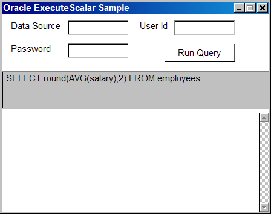
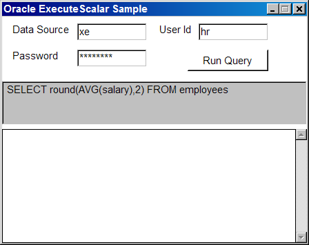
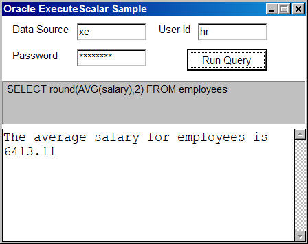

# Oracle Recipe #2: How to execute a query that returns a Scalar result with OracleCommand

Microsoft ADO.NET command objects have an ExecuteScalar method, which enables you to execute a query that returns a single result.

The most commonly steps for using ADO.NET data access classes are:
<ol>
<li>Open a database connection.</li>
<li>Create and initialize a command object.</li>
<li>Call the ExecuteScalar method on the command object.</li>
<li>Convert the return value from ExecuteScalar into an appropriate data type.</li>
<li>Dispose the command object.</li>
<li>Close the database connection.</li>
</ol>

The following example, show how to execute a query that determines the average salary from the table employees on the HR schema provided by Oracle Database XE. The example assume that the query does not return a NULL result.

<b>fig 1 Running the program</b>
 

<b>fig 2 Enter the data for connection string.</b>
 

<b>fig 3 Executing the query</b>

This program uses the HR samples from Oracle :
<a href="https://github.com/oracle-samples/db-sample-schemas">Oracle db samples</a>

